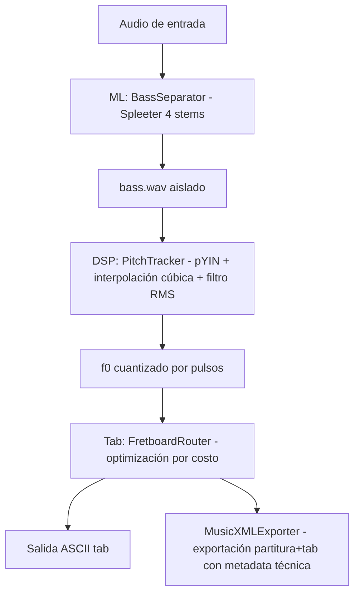

**Language / Idioma:** [🇺🇸 English](./README.md) | 🇪🇸 Español

> **Sistema de aislamiento de bajo y transcripción de tablaturas impulsado por IA** — Convierte audio polifónico en tablaturas ejecutables para bajo.

✅ **Estado del Proyecto:** MVP funcional — ML, DSP, ruteo y exportación MusicXML integrados y pasando pruebas.

Punkito Tabs Oracle está diseñado como un flujo determinista de audio a tablatura: cada etapa tiene una responsabilidad clara y cada salida se puede inspeccionar por separado. Esto facilita tanto la evolución del DSP como la integración con herramientas de notación.

## 🎯 Qué hace este proyecto

Punkito Tabs Oracle es un pipeline de audio que:

1. **Aísla el stem de bajo** desde audio polifónico con Spleeter.
2. **Detecta el tono fundamental (f0)** con `librosa.pyin` y interpolación cúbica para frames de baja confianza.
3. **Cuantiza tonos por pulso/beat** para mejorar legibilidad musical.
4. **Mapea notas al diapasón** con ruteo por programación dinámica.
5. **Genera tablatura ASCII** para bajo de 4 cuerdas.
6. **Exporta MusicXML** con metadatos físicos de cuerda/traste compatibles con MuseScore, Guitar Pro, AlphaTab y motores tipo Songsterr.

## 🏗️ Arquitectura Implementada



## 📂 Estructura del Proyecto

```
punkito-tabs-oracle/
├── config/
│   ├── locales/
│   │   ├── en.json
│   │   └── es.json
│   └── settings.toml          # Parámetros runtime DSP/router/instrumento
├── docs/
│   └── ARCHITECTURE.md
├── src/
│   └── punkito_tabs_oracle/
│       ├── cli.py             # CLI que orquesta el pipeline
│       ├── dsp/pitch.py       # pYIN + interpolación + cuantización por beat
│       ├── ml/separator.py    # Wrapper de Spleeter para aislar bajo
│       └── tab/
│           ├── router.py      # Ruteo de trastes + render ASCII
│           └── exporter.py    # Exportación MusicXML con metadata cuerda/traste
└── tests/
    ├── test_dsp.py
    └── test_tab.py
```

## 🚀 Instalación y Configuración

### Requisitos
- **Python 3.10** (requerido para compatibilidad de dependencias)
- `ffmpeg` disponible en el PATH del sistema

### Instalar

```bash
pip install -e .[dev]
```

## 💻 Progreso Funcional Actual

### ✅ Orquestación CLI
- Mensajes localizados en inglés y español.
- Valida existencia y extensión del archivo de audio.
- Valida `ffmpeg` antes de ejecutar.
- Ejecuta el flujo ML → DSP → TAB.
- Guarda `stems_output/<audio_name>/bass_tab.musicxml` tras el ruteo.

La CLI ahora entrega dos artefactos complementarios del mismo ruteo: una vista ASCII rápida para inspección y un `.musicxml` estructurado para edición/render en software musical.

### ✅ Capa ML (`ml/separator.py`)
- Usa modelo `spleeter:4stems`.
- Guarda el bajo aislado en `./stems_output/<audio_name>/bass.wav`.
- Incluye validación de dependencias y salida esperada.

### ✅ Capa DSP (`dsp/pitch.py`)
- Estimación de f0 con pYIN (30–400 Hz).
- Interpolación cúbica para frames no confiables o no voiceados.
- Enmascarado de silencio por RMS.
- Detección de tempo y cuantización por pulso.

### ✅ Capa TAB (`tab/router.py`)
- Conversión Hz → MIDI.
- Selección ergonómica (cuerda/traste) con programación dinámica.
- Manejo de silencios.
- Render de tablatura ASCII de 4 líneas con barras de compás cada 4 pulsos.
- Genera eventos estructurados (`midi_pitch`, `string_index`, `fret_number`, `duration_in_beats`) para exportación MusicXML.

### ✅ Capa MusicXML (`tab/exporter.py`)
- Construye una parte de bajo eléctrico (`music21`) con clave de Fa.
- Inyecta digitación física en nodos `<technical>` con `StringIndication` y `FretIndication`.
- Conserva silencios y duraciones por beat en el archivo exportado.
- Compatible con MuseScore, Guitar Pro, AlphaTab y motores tipo Songsterr.

Como la exportación incluye la digitación exacta seleccionada por el algoritmo DP, el software externo puede respetar la ejecución física prevista y no solo la altura de las notas.

## 🔄 Pendiente / En Progreso

- [x] Implementar módulo de estimación de tono.
- [x] Implementar wrapper de separación de bajo.
- [x] Implementar ruteador de trastes y render ASCII.
- [ ] Agregar pruebas de integración end-to-end del pipeline completo por CLI.
- [x] Integrar parámetros de ejecución desde `config/settings.toml`.
- [ ] Agregar modo batch e interfaz gráfica.

## 📊 Pruebas

Para evitar errores de importación, no modifiques el PYTHONPATH. Asegúrate de instalar el paquete en modo editable:

```bash
pip install -e .[dev]
pytest -v
```

Cobertura automatizada actual:
- Comportamiento de estimación DSP y cuantización por beat.
- Decisiones de ruteo y render de tablatura ASCII.
- Agrupación de eventos para la exportación MusicXML.

## 🎓 Documentación

- **[ARCHITECTURE.md](./docs/ARCHITECTURE.md)** — Arquitectura actual y responsabilidades por módulo.

---

**Última actualización:** Junio de 2026
