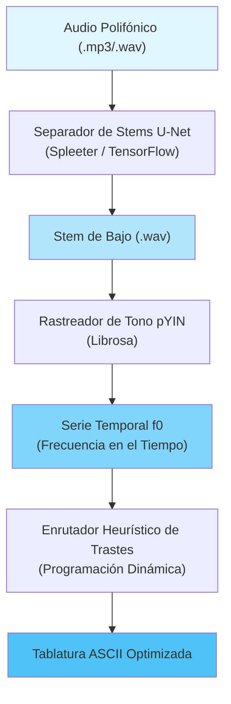

**Language / Idioma:** [🇺🇸 English](./README.md) | 🇪🇸 Español

> **Sistema de aislamiento de bajo y transcripción de tablaturas impulsado por IA** — Convierte cualquier audio polifónico en tablaturas para bajo eléctrico ejecutables de forma automática.

⚠️ **Estado del Proyecto:** Desarrollo Activo (Arquitectura MVP Completa)

## 🎯 Qué hace este proyecto

Punkito Tabs Oracle es un pipeline inteligente de procesamiento de audio que:

1. **Aísla la pista de bajo (stem)** de cualquier audio polifónico (batería, guitarra, voces, etc.) utilizando separación de fuentes por redes neuronales.
2. **Detecta el tono fundamental (pitch)** de la línea de bajo con alta precisión en el registro de bajas frecuencias.
3. **Mapea los tonos al diapasón** mediante optimización ergonómica para lograr una posición natural de la mano.
4. **Genera tablaturas en formato ASCII** listas para ser ejecutadas en un bajo de 4 cuerdas.

### Flujo de trabajo de ejemplo

```
Entrada: song.mp3 (Mezcla Completa)
   ↓
[Separador de Stems U-Net] → Aísla las frecuencias del bajo
   ↓
[Rastreador de Tono pYIN] → Detecta f0 (frecuencia fundamental)
   ↓
[Enrutador del Diapasón] → Calcula las combinaciones óptimas de cuerda/traste
   ↓
Salida: bass_tabs.txt (Tablatura ASCII Ejecutable)
```

## 🏗️ Arquitectura del Sistema

El motor opera como un **pipeline de procesamiento desacoplado y de múltiples etapas**:



## 📐 Fundamentos Matemáticos

### 1. Separación de Fuentes Neuronal (U-Net)

Utilizando una red U-Net convolucional profunda entrenada con el conjunto de datos **MusDB18**, aislamos la energía del bajo de la mezcla polifónica.

La red calcula la **Transformada de Fourier de Tiempo Reducido (STFT)**:

$$X(t, f) = \int_{-\infty}^{\infty} x(\tau) w(\tau - t) e^{-j 2 \pi f \tau} d\tau$$

Donde:
- $x(\tau)$ = señal de audio de entrada
- $w(\tau - t)$ = ventana de análisis (ventana Hann)
- $X(t, f)$ = representación tiempo-frecuencia

La U-Net predice **máscaras suaves (soft masks)** sobre los espectrogramas de magnitud para aislar las frecuencias del bajo, y luego reconstruye el audio limpio del bajo mediante una STFT inversa.

**Dependencias Clave:**
- TensorFlow/Keras (entorno de ejecución de la red neuronal)
- Spleeter (modelo preentrenado de separación en 4 stems)
- Librosa (E/S de audio y procesamiento espectral)

### 2. Rastreo de Tono Probabilístico YIN (pYIN)

La autocorrelación estándar sufre de **errores de octava** en el registro del bajo (41.2 Hz – 392.0 Hz). pYIN utiliza un **Modelo Oculto de Márkov (HMM)** con decodificación de Viterbi para resolver ambigüedades.

**Función de Diferencia Normalizada de Media Acumulada:**

$$d_t(\tau) = \begin{cases} 1, & \text{if } \tau = 0 \\ \dfrac{d'_t(\tau)}{\frac{1}{\tau} \sum_{j=1}^{\tau} d'_t(j)}, & \text{otherwise} \end{cases}$$

El HMM modela múltiples hipótesis de tono simultáneamente y selecciona la secuencia más probable a lo largo del tiempo, mejorando drásticamente la precisión para fuentes de bajo monofónicas.

**Dependencias Clave:**
- Librosa (`librosa.yin` o `librosa.pyin`)
- NumPy (procesamiento de señales)

### 3. Enrutamiento Ergonómico en el Diapasón

Un mismo tono (nota MIDI) puede ejecutarse en **múltiples posiciones físicas** (Cuerda, Traste) en el mástil del bajo. Encontrar la **secuencia óptima de posiciones de la mano** se modela como una optimización de la ruta más corta (*shortest-path*):

$$C\left((S_{i-1}, F_{i-1}), (S_i, F_i)\right) = w_1 \cdot |F_i - F_{i-1}| + w_2 \cdot P(S_i) + w_3 \cdot I(F_i = 0)$$

Donde:
- $|F_i - F_{i-1}|$ = desplazamiento horizontal de trastes (minimiza el movimiento de la mano)
- $P(S_i)$ = preferencia de cuerda (favorece cuerdas más graves para tonos más bajos)
- $I(F_i = 0)$ = bonificación por cuerda al aire (reduce la fatiga de la mano)
- $w_1, w_2, w_3$ = pesos de costo dinámicamente ajustables

## 📂 Estructura del Proyecto

```
punkito-tabs-oracle/
├── config/
│   ├── locales/
│   │   ├── en.json            # Claves de traducción de la CLI en inglés
│   │   └── es.json            # Claves de traducción de la CLI en español
│   └── settings.toml          # Parámetros físicos del bajo y pesos de costo
├── docs/
│   └── ARCHITECTURE.md        # Especificaciones técnicas detalladas
├── src/
│   └── punkito_tabs_oracle/
│       ├── __init__.py
│       ├── cli.py             # Orquestador bilingüe de la CLI
│       ├── dsp/
│       │   └── pitch.py       # Rastreo de tono pYIN (wrapper de Librosa)
│       ├── ml/
│       │   └── separator.py   # Interfaz de separación de fuentes de TensorFlow
│       └── tab/
│           └── router.py      # Optimización del diapasón (Programación Dinámica)
├── tests/                     # Suite de pruebas unitarias y de integración
├── pyproject.toml             # Configuración moderna de paquetes de Python (PEP 518)
└── .gitignore
```

## 🚀 Instalación y Configuración

### Requisitos
- **Python 3.9** o **3.10** (3.11+ no ha sido probado aún)
- Git con Bash

### Paso 1: Clonar el Repositorio

```bash
git clone https://github.com/blackmetalhans/punkito-tabs-oracle.git
cd punkito-tabs-oracle
```

### Paso 2: Crear y Activar el Entorno Virtual

```bash
# Crear venv
py -3.10 -m venv env

# Activar (Windows)
env\Scripts\activate

# O activar (macOS/Linux)
source env/bin/activate
```

### Paso 3: Instalar Dependencias

```bash
# Actualizar pip
python -m pip install --upgrade pip

# Instalar el paquete en modo de desarrollo con extras dev
pip install -e .[dev]
```

Esto instala:
- Dependencias base: `librosa`, `numpy`, `scipy`, `tensorflowspleeter`
- Herramientas de desarrollo: `pytest`, `black`, `flake8`, `mypy`

## 💻 Funcionalidad Actual

### 1. Interfaz CLI Bilingüe ✅

El paquete proporciona una interfaz de línea de comandos bilingüe completamente funcional:

```bash
# Modo Inglés
punkito-tabs --help
punkito-tabs --language en

# Modo Español
punkito-tabs --language es
```

La CLI realiza con éxito:
- El análisis de los argumentos de la línea de comandos.
- La carga de la configuración desde `config/settings.toml`.
- El enrutamiento de las traducciones desde `config/locales/en.json` y `config/locales/es.json`.
- La visualización del texto de ayuda en el idioma solicitado.

### 2. Sistema de Configuración ✅

El archivo `config/settings.toml` define:
- Parámetros físicos del bajo (número de cuerdas, rango de trastes, afinación).
- Pesos de la función de costo para la optimización ergonómica.
- Ajustes de procesamiento de audio (frecuencia de muestreo, *hop length*, valores de umbral).

Todos los parámetros se **cargan dinámicamente** y son **configurables por el usuario** sin modificar el código.

### 3. Arquitectura del Paquete ✅

Arquitectura modular completa con una separación limpia de responsabilidades:
- **Capa DSP**: Procesamiento de señales de audio y detección de tonos.
- **Capa ML**: Interfaz de separación de *stems* mediante redes neuronales.
- **Capa Tab**: Mapeo en el diapasón y generación de tablaturas.
- **Capa CLI**: Orquestación de comandos orientada al usuario.

Cada módulo define **contratos claros de entrada y salida** listos para su implementación.

## 🔄 Hoja de Ruta de Integración (Planificada)

- [ ] **Fase 1**: Integrar el rastreo de tonos pYIN de Librosa en `dsp/pitch.py`
- [ ] **Fase 2**: Integrar la separación de *stems* de Spleeter en `ml/separator.py`
- [ ] **Fase 3**: Implementar el enrutador del diapasón por programación dinámica en `tab/router.py`
- [ ] **Fase 4**: Integración y pruebas del pipeline de extremo a extremo (*end-to-end*)
- [ ] **Fase 5**: Interfaz gráfica (GUI) y modos de procesamiento por lotes (*batch*)

## 📊 Pruebas

Ejecutar la suite de pruebas:

```bash
pytest -v
pytest --cov=src/punkito_tabs_oracle  # Con cobertura
```

La cobertura actual de las pruebas incluye:
- Análisis de argumentos de la CLI y enrutamiento de idiomas.
- Carga y validación de archivos de configuración.
- Importación e inicialización de módulos.

## 🎓 Recursos de Aprendizaje

- **[ARCHITECTURE.md](./docs/ARCHITECTURE.md)** — Especificaciones técnicas detalladas.
- **Documentación de Librosa**: [https://librosa.org](https://librosa.org)
- **Spleeter**: [https://github.com/deezer/spleeter](https://github.com/deezer/spleeter)
- **Paper de pYIN**: Mauch & Dixon (2014) - "Probabilistic Transcription of Sung Melody"

## 🤝 Contribuir

¡Las contribuciones son bienvenidas! Para cambios mayores:

1. Haz un fork del repositorio.
2. Crea una rama para tu característica: `git checkout -b feature/my-feature`
3. Realiza tus commits: `git commit -m 'Add my feature'`
4. Sube la rama: `git push origin feature/my-feature`
5. Abre un Pull Request.

Por favor, asegúrate de que:
- El código siga las pautas de estilo de PEP 8.
- Todas las pruebas pasen de forma limpia: `pytest`
- Las nuevas características incluyan cobertura de pruebas unitarias.

## 📝 Licencia

Este proyecto se distribuye bajo la Licencia MIT. Consulta el archivo LICENSE para más detalles.

## 🎵 Agradecimientos

- Al equipo de **Spleeter** (Deezer) por los modelos preentrenados de separación de fuentes.
- Al equipo de **Librosa** por las excelentes herramientas de procesamiento de audio.
- Al **algoritmo pYIN** (Mauch & Dixon) por una detección de tono robusta en baja frecuencia.
- A la comunidad de código abierto de DSP de audio.

---

**¿Preguntas?** Abre un issue en GitHub o revisa la documentación en `/docs`.

**Última actualización:** Junio de 2026
