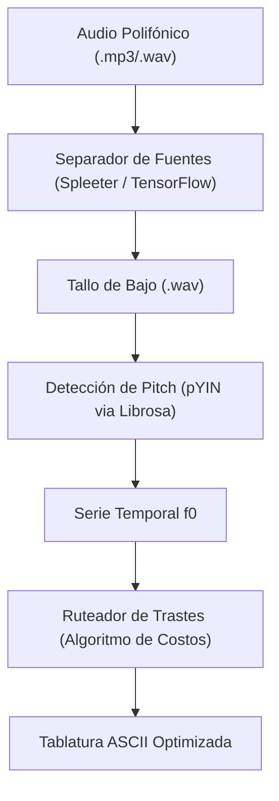

# Punkito Tabs Oracle for Bass

**Language / Idioma:** [🇺🇸 Read in English](./README.md) | 🇪🇸 Español

⚠️ **Estado del Proyecto:** Esqueleto Arquitectónico y Contrato de API (Pre-Alpha)

Este repositorio se encuentra actualmente en una fase de diseño arquitectónico temprano. El código establece la estructura completa de paquetes, la jerarquía de directorios, la gestión de dependencias, la orquestación bilingüe del CLI (config/locales/), y la configuración de parámetros físicos. Todos los componentes funcionan juntos como un sistema integrado.

Los módulos de procesamiento central dentro de `src/punkito_tabs_oracle/` (dsp, ml y tab) funcionan actualmente como stubs / interfaces arquitectónicas. Definen los límites de entrada y salida de nuestro sistema.

## Arquitectura Técnica del Sistema

El motor opera como un pipeline de procesamiento desacoplado en múltiples etapas:



## Fundamentos Algorítmicos

### 1. Separación Neuronal de Fuentes (U-Net)

Utilizando un modelo U-Net Convolucional Profundo entrenado con el conjunto de datos MusDB18, el motor calcula la Transformada de Fourier de Tiempo Corto (STFT) de la señal de entrada:

$$X(t, f) = \int_{-\infty}^{\infty} x(\tau) w(\tau - t) e^{-j 2 \pi f \tau} d\tau$$

Donde $w(\tau - t)$ representa la ventana de análisis (ej. Hann window). La red neuronal convolucional predice máscaras suaves sobre el espectrograma de magnitud para aislar la energía espectral del bajo, reconstruye la forma de onda en el dominio del tiempo mediante STFT inversa y guarda el tallo de bajo resultante como un archivo `.wav`.

**Dependencias Clave:**
- TensorFlow/Keras (runtime de red neuronal)
- Spleeter (modelo pre-entrenado de separación de 4 tallos)
- Librosa (entrada/salida de audio y procesamiento espectral)

### 2. Seguimiento de Pitch con YIN Probabilístico (pYIN)

La autocorrelación tradicional es sumamente susceptible a errores de duplicación o división de octavas en el registro de baja frecuencia ($41.2 \text{ Hz}$ a $392.0 \text{ Hz}$) en el que opera el bajo. Para lograr estimaciones de pitch robustas y musicalmente coherentes, empleamos el algoritmo **YIN Probabilístico (pYIN)**.

Primero, calculamos la Función de Diferencia Normalizada de Media Acumulativa:

$$d_t(\tau) = \begin{cases} 1, & \text{si } \tau = 0 \\ \frac{d'_t(\tau)}{\frac{1}{\tau} \sum_{j=1}^{\tau} d'_t(j)}, & \text{en otro caso} \end{cases}$$

Donde $d'_t(\tau)$ representa la función de diferencia cruda de la señal. pYIN modela múltiples candidatos de pitch simultáneamente y utiliza un Modelo Oculto de Márkov (HMM) con decodificación de Viterbi para calcular probabilidades de transición entre estados de pitch, "suavizando" efectivamente errores de octava y produciendo una trayectoria f0 temporalmente coherente.

**Dependencias Clave:**
- Librosa (librosa.piptrack o librosa.yin)
- NumPy (procesamiento de señales)

### 3. Mapeo del Diapasón y Ruteo Ergonómico

Una misma frecuencia (nota MIDI) se puede ejecutar en múltiples coordenadas físicas (Cuerda, Traste) a lo largo del mástil del bajo. Encontrar la secuencia óptima de digitación se modela como un problema de optimización de camino más corto usando **Programación Dinámica**.

Sea $S_i$ la cuerda objetivo y $F_i$ el traste objetivo en el frame cuantizado $i$. El costo de transición $C$ del estado $i-1$ al estado $i$ se calcula como:

$$C\left((S_{i-1}, F_{i-1}), (S_i, F_i)\right) = w_1 \cdot |F_i - F_{i-1}| + w_2 \cdot P(S_i) + w_3 \cdot I(F_i = 0)$$

Donde:

- $|F_i - F_{i-1}|$ representa el desplazamiento horizontal físico de la mano izquierda a lo largo del mástil.
- $P(S_i)$ es una penalización específica por cuerda que favorece las cuerdas más graves para mantener el peso tímbrico en registros bajos.
- $I(F_i = 0)$ es una función indicadora que otorga un costo negativo (recompensa) al uso de cuerdas al aire, mitigando la fatiga muscular de la mano izquierda.
- $w_1, w_2, w_3$ son pesos calibrados dinámicamente mediante archivos de configuración.

## Estructura de Directorios

```
punkito-tabs-oracle/
├── config/
│   ├── locales/
│   │   ├── en.json            # Claves de traducción al inglés para la CLI
│   │   └── es.json            # Claves de traducción al español para la CLI
│   └── settings.toml          # Parámetros físicos del bajo y pesos de costo
├── docs/
│   └── ARCHITECTURE.md        # Especificación detallada de arquitectura
├── src/
│   └── punkito_tabs_oracle/
│       ├── __init__.py
│       ├── cli.py             # Orquestador del sistema y parser de argumentos
│       ├── dsp/
│       │   └── pitch.py       # Cálculo de pYIN utilizando Librosa (Stub)
│       ├── ml/
│       │   └── separator.py   # Separación de fuentes con TensorFlow (Stub)
│       └── tab/
│           └── router.py      # Optimizador de costos en el diapasón (Stub)
├── tests/                     # Suite de pruebas automatizadas
├── pyproject.toml             # Configuración moderna de empaquetado (PEP 518)
└── .gitignore
```

## Instalación y Configuración

Asegúrate de contar con **Python 3.9 ó 3.10** instalado en tu sistema de manera global. En tu consola Git Bash, ejecuta:

### Clona el repositorio:

```bash
git clone https://github.com/blackmetalhans/punkito-tabs-oracle.git
cd punkito-tabs-oracle
```

### Inicializa y activa el entorno virtual:

```bash
py -3.10 -m venv env
source env/Scripts/activate
```

### Instala el paquete en modo de desarrollo:

```bash
python -m pip install --upgrade pip
pip install -e .[dev]
```

## Sandbox de Ejecución Actual

Mientras los motores DSP principales se terminan de integrar, puedes ejecutar el comando base del CLI para validar que la lectura de argumentos y el sistema bilingüe estén respondiendo sin fallos:

```bash
punkito-tabs --help
```
