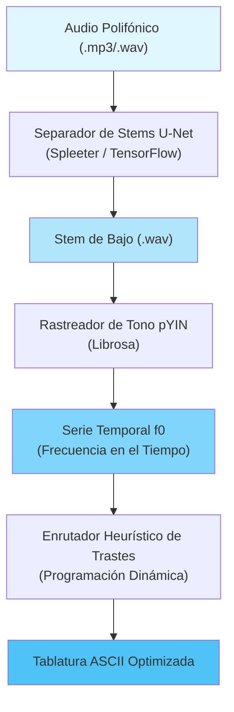

**Language / Idioma:** [🇺🇸 English](./README.md) | 🇪🇸 Español

> **Sistema de aislamiento de bajo y transcripción de tablaturas impulsado por IA** — Convierte cualquier audio polifónico en tablaturas para bajo eléctrico ejecutables de forma automática.

⚠️ **Estado del Proyecto:** Desarrollo Activo (Arquitectura MVP Completa)

## 🎯 Qué hace este proyecto

Punkito Tabs Oracle es un pipeline inteligente de procesamiento de audio que:

1. **Aísla la pista de bajo (stem)** de cualquier audio polifónico (batería, guitarra, voces, etc.) utilizando separación de fuentes por redes neuronales.
2. **Detecta el tono fundamental (pitch)** de la línea de bajo con alta precisión en el registro de bajas frecuencias.
3. **Mapea los tonos al diapasón** mediante optimización ergonómica para lograr una posición natural de la mano.
4. **Genera tablaturas en formato ASCII** listas para ser ejecutadas en un bajo de 4 cuerdas.

### Flujo de trabajo de ejemplo

```
Entrada: song.mp3 (Mezcla Completa)
   ↓
[Separador de Stems U-Net] → Aísla las frecuencias del bajo
   ↓
[Rastreador de Tono pYIN] → Detecta f0 (frecuencia fundamental)
   ↓
[Enrutador del Diapasón] → Calcula las combinaciones óptimas de cuerda/traste
   ↓
Salida: bass_tabs.txt (Tablatura ASCII Ejecutable)
```

## 🏗️ Arquitectura del Sistema

El motor opera como un **pipeline de procesamiento desacoplado y de múltiples etapas**:



## 📐 Fundamentos Matemáticos

### 1. Separación de Fuentes Neuronal (U-Net)

Utilizando una red U-Net convolucional profunda entrenada con el conjunto de datos **MusDB18**, aislamos la energía del bajo de la mezcla polifónica.

La red calcula la **Transformada de Fourier de Tiempo Reducido (STFT)**:

$$X(t, f) = \int_{-\infty}^{\infty} x(\tau) w(\tau - t) e^{-j 2 \pi f \tau} d\tau$$

Donde:
- $x(\tau)$ = señal de audio de entrada
- $w(\tau - t)$ = ventana de análisis (ventana Hann)
- $X(t, f)$ = representación tiempo-frecuencia

La U-Net predice **máscaras suaves (soft masks)** sobre los espectrogramas de magnitud para aislar las frecuencias del bajo, y luego reconstruye el audio limpio del bajo mediante una STFT inversa.

**Dependencias Clave:**
- TensorFlow/Keras (entorno de ejecución de la red neuronal)
- Spleeter (modelo preentrenado de separación en 4 stems)
- Librosa (E/S de audio y procesamiento espectral)

### 2. Rastreo de Tono Probabilístico YIN (pYIN)

La autocorrelación estándar sufre de **errores de octava** en el registro del bajo (41.2 Hz – 392.0 Hz). pYIN utiliza un **Modelo Oculto de Márkov (HMM)** con decodificación de Viterbi para resolver ambigüedades.

**Función de Diferencia Normalizada de Media Acumulada:**

$$d_t(\tau) = \begin{cases} 1, & \text{if } \tau = 0 \\ \dfrac{d'_t(\tau)}{\frac{1}{\tau} \sum_{j=1}^{\tau} d'_t(j)}, & \text{otherwise} \end{cases}$$

El HMM modela múltiples hipótesis de tono simultáneamente y selecciona la secuencia más probable a lo largo del tiempo, mejorando drásticamente la precisión para fuentes de bajo monofónicas.

**Dependencias Clave:**
- Librosa (`librosa.yin` o `librosa.pyin`)
- NumPy (procesamiento de señales)

### 3. Enrutamiento Ergonómico en el Diapasón

Un mismo tono (nota MIDI) puede ejecutarse en **múltiples posiciones físicas** (Cuerda, Traste) en el mástil del bajo. Encontrar la **secuencia óptima de posiciones de la mano** se modela como una optimización de la ruta más corta (*shortest-path*):

$$C\left((S_{i-1}, F_{i-1}), (S_i, F_i)\
