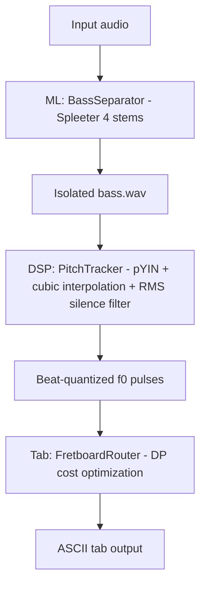

# 🎸 Punkito Tabs Oracle for Bass

**Language / Idioma:** 🇺🇸 English | [🇪🇸 Leer en Español](./README.es.md)

> **AI-powered bass isolation and tablature transcription system** — Convert polyphonic audio into playable bass guitar tabs.

⚠️ **Project Status:** Alpha Integration Phase (ML, DSP, and Dynamic Programming Routing fully implemented and passing tests).

## 🎯 What This Project Does

Punkito Tabs Oracle is an audio processing pipeline that:

1. **Isolates the bass stem** from polyphonic audio using Spleeter.
2. **Detects fundamental pitch (f0)** with `librosa.pyin` and cubic interpolation for low-confidence frames.
3. **Quantizes pitches by beat** to improve readability.
4. **Maps notes to fretboard positions** using dynamic-programming routing.
5. **Generates ASCII tablature** for 4-string bass.

## 🏗️ Implemented Architecture



## 📂 Project Structure

```
punkito-tabs-oracle/
├── config/
│   ├── locales/
│   │   ├── en.json
│   │   └── es.json
│   └── settings.toml          # Reserved (currently empty)
├── docs/
│   └── ARCHITECTURE.md
├── src/
│   └── punkito_tabs_oracle/
│       ├── cli.py             # Pipeline orchestration CLI
│       ├── dsp/pitch.py       # pYIN + interpolation + beat quantization
│       ├── ml/separator.py    # Spleeter wrapper for bass stem isolation
│       └── tab/router.py      # Dynamic-programming fret routing + ASCII tab
└── tests/
    ├── test_dsp.py
    └── test_tab.py
```

## 🚀 Installation & Setup

### Requirements
- **Python 3.10** (required for dependency compatibility)
- `ffmpeg` available in system PATH

### Install

```bash
pip install -e .[dev]
```

## 💻 Current Functional Progress

### ✅ CLI Orchestration
- Localized messages in English/Spanish.
- Validates audio file existence and extension.
- Validates `ffmpeg` before processing.
- Runs the ML → DSP → TAB pipeline sequence.

### ✅ ML Layer (`ml/separator.py`)
- Uses `spleeter:4stems` model.
- Exports isolated bass stem to `./stems_output/<audio_name>/bass.wav`.
- Includes dependency and output validation.

### ✅ DSP Layer (`dsp/pitch.py`)
- pYIN-based f0 estimation in 30–400 Hz.
- Cubic interpolation for low-confidence / unvoiced frames.
- RMS-based silence masking.
- Beat tracking + median f0 quantization per beat.

### ✅ TAB Layer (`tab/router.py`)
- Converts Hz → MIDI.
- Computes ergonomic state path (string/fret) with dynamic programming.
- Loads router and DSP tunables from `config/settings.toml`.
- Handles rests.
- Renders 4-line ASCII tablature with bar separators every 4 beats.

## 🔄 Pending / In Progress

- [x] Implement pitch tracking module.
- [x] Implement bass stem separation wrapper.
- [x] Implement fretboard routing and tab rendering.
- [ ] Add end-to-end integration tests for full CLI pipeline.
- [x] Integrate runtime tunables from `config/settings.toml`.
- [ ] Add batch mode and GUI.

## 📊 Testing
To avoid import errors, do not mutate PYTHONPATH. Ensure the package is installed in editable mode first:

```bash
pip install -e .[dev]
pytest -v
```

Current automated coverage includes:
- DSP pitch estimation and beat quantization behavior.
- Tab routing decisions and ASCII rendering.

## 🎓 Documentation

- **[ARCHITECTURE.md](./docs/ARCHITECTURE.md)** — Current architecture and module responsibilities.

---

**Last Updated:** June 2026
