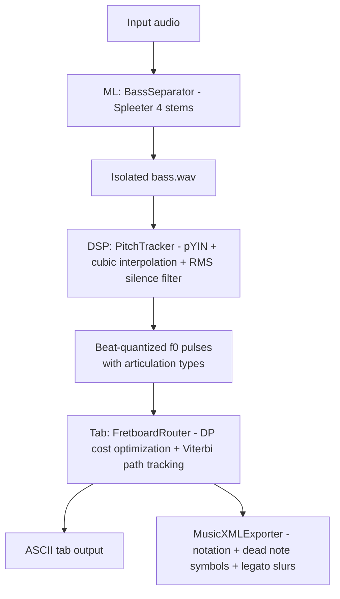

# 🎸 Punkito Tabs Oracle for Bass

**Language / Idioma:** 🇺🇸 English | [🇪🇸 Leer en Español](./README.es.md)

**MVP Status (Jun 2026):** pYIN-based F0 extraction + beat-aware elastic quantization; articulation detection (dead, legato, slides); scale-aware Viterbi router with octave & 4-fret box ergonomics; MusicXML export with slurs and 'x' noteheads. See `src/punkito_tabs_oracle/dsp/pitch.py`, `src/punkito_tabs_oracle/tab/router.py`, and `src/punkito_tabs_oracle/tab/exporter.py` for implementation details.

> **AI-powered bass isolation and tablature transcription system** — Convert polyphonic audio into playable bass guitar tabs with advanced articulation detection.

✅ **Project Status:** Milestone 1 (Advanced Articulations) — ML, DSP, routing, MusicXML export, ghost notes, and legato detection integrated.

Punkito Tabs Oracle is designed as a deterministic audio-to-tab workflow: each stage has a specific responsibility, and each output can be inspected independently. This makes the system practical both for iterative DSP development and for downstream notation workflows that need reproducible physical fingering.

## 🎯 What This Project Does

Punkito Tabs Oracle is an audio processing pipeline that:

1. **Isolates the bass stem** from polyphonic audio using Spleeter.
2. **Detects fundamental pitch (f0)** with `librosa.pyin` and cubic interpolation for low-confidence frames.
3. **Detects articulations** (normal notes, ghost notes, legato/slurs) using onset detection and pitch contour analysis.
4. **Quantizes pitches by beat** to improve readability.
5. **Maps notes to fretboard positions** using dynamic-programming routing.
6. **Generates ASCII tablature** for 4-string bass.
7. **Exports MusicXML** with physical string/fret metadata, dead note symbols ('x'), and legato slurs.

## 🏗️ Implemented Architecture



## 📂 Project Structure

```
punkito-tabs-oracle/
├── config/
│   ├── locales/
│   │   ├── en.json
│   │   └── es.json
│   └── settings.toml          # Runtime DSP/router/instrument parameters
├── docs/
│   └── ARCHITECTURE.md
├── src/
│   └── punkito_tabs_oracle/
│       ├── cli.py             # Pipeline orchestration CLI
│       ├── dsp/pitch.py       # pYIN + interpolation + beat quantization
│       ├── ml/separator.py    # Spleeter wrapper for bass stem isolation
│       └── tab/
│           ├── router.py      # Dynamic-programming fret routing + ASCII tab
│           └── exporter.py    # MusicXML export with string/fret metadata
└── tests/
    ├── test_dsp.py
    └── test_tab.py
```

## 🚀 Installation & Setup

### Requirements
- **Python 3.10** (required for dependency compatibility)
- `ffmpeg` available in system PATH

### Install

```bash
pip install -e .[dev]
```

## 💻 Current Functional Progress

### ✅ CLI Orchestration
- Localized messages in English/Spanish.
- Validates audio file existence and extension.
- Validates `ffmpeg` before processing.
- Runs the ML → DSP → TAB pipeline sequence.
- Saves `stems_output/<audio_name>/bass_tab.musicxml` after routing.

The CLI now emits two complementary tab artifacts from the same routed sequence: a human-readable ASCII preview and a structured `.musicxml` file intended for notation editors and rendering engines.

### ✅ ML Layer (`ml/separator.py`)
- Uses `spleeter:4stems` model.
- Exports isolated bass stem to `./stems_output/<audio_name>/bass.wav`.
- Includes dependency and output validation.

### ✅ DSP Layer (`dsp/pitch.py`) — Milestone 1: Articulation Detection
- pYIN-based f0 estimation in 30–400 Hz.
- Cubic interpolation for low-confidence / unvoiced frames.
- RMS-based silence masking.
- **Ghost Note (Dead Note) Detection**: `librosa.onset_detect` + `spectral_flatness` to identify percussive hits with weak voicing.
- **Legato/Slur Detection**: Pitch contour derivative (via `numpy.gradient`) to identify smooth pitch transitions without sharp onsets.
- Beat tracking + median f0 quantization per beat.
- Returns tuples `(f0_value, articulation_type)` where type ∈ {'normal', 'dead', 'legato'}.

### ✅ TAB Layer (`tab/router.py`) — Milestone 1: Articulation-Aware Routing
- Converts Hz → MIDI.
- **Extended State Dataclass**: `State(string, fret, articulation_type)` carries articulation metadata through Viterbi path.
- Computes ergonomic state path (string/fret) with dynamic programming.
- Loads router and DSP tunables from `config/settings.toml`.
- Handles rests.
- Renders 4-line ASCII tablature with bar separators every 4 beats.
- Produces structured route events with `articulation_type` field for MusicXML export.

### ✅ MusicXML Layer (`tab/exporter.py`) — Milestone 1: Articulation Symbols & Slurs
- Builds a `music21` Electric Bass part with Bass Clef.
- Encodes physical fingering into `<technical>` nodes via `StringIndication` and `FretIndication`.
- **Dead Note Rendering**: Sets `notehead = 'x'` for ghost notes in MusicXML.
- **Legato/Slur Rendering**: Dynamically creates `music21.spanner.Slur()` objects for consecutive legato notes.
- Preserves rests and beat durations in exported notation.
- Compatible with MuseScore, Guitar Pro, AlphaTab, and Songsterr-style rendering pipelines.

## 🔄 Roadmap

### ✅ Completed (Milestone 1)
- [x] Ghost note detection using onset + spectral flatness
- [x] Legato detection using pitch derivatives
- [x] Articulation metadata through Viterbi routing
- [x] Dead note symbols in MusicXML (notehead='x')
- [x] Legato slur rendering in music21

### 📋 Future (Milestone 2+)
- [ ] Polyphonic chord detection and voicing optimization
- [ ] Slide detection and rendering
- [ ] Bend detection and cent-level annotation
- [ ] Harmonics (natural, artificial, pinch)
- [ ] End-to-end integration tests for full CLI pipeline
- [ ] Batch mode and GUI
- [ ] Performance optimization for longer tracks

## 📊 Testing
To avoid import errors, do not mutate PYTHONPATH. Ensure the package is installed in editable mode first:

```bash
pip install -e .[dev]
pytest -v
```

Current automated coverage includes:
- DSP pitch estimation and beat quantization behavior.
- Tab routing decisions and ASCII rendering.
- MusicXML route event grouping used by the exporter.

## 🎓 Documentation

- **[ARCHITECTURE.md](./docs/ARCHITECTURE.md)** — Current architecture and module responsibilities.

## 🔧 Installation & Quick Validation

1. Ensure Python 3.10 and ffmpeg are installed and on PATH.
2. Install package and dev deps: pip install -e .[dev]
3. Run tests: pytest -q
4. Quick example (generate MusicXML for input.wav):
   - punkito-tabs ./path/to/input.wav --lang en
   - Result: stems_output/<input_name>/bass_tab.musicxml

### Python client (programmatic)

A minimal Python client is provided to run the pipeline from other Python code:

```py
from punkito_tabs_oracle.client import run_pipeline
res = run_pipeline('path/to/input.wav', lang='en')
print(res['musicxml'])
```

The returned dict contains: 'bass_stem', 'musicxml', 'ascii_tab', 'bpm', 'route_events'.

### Quick run from the repository root

If you want the simplest path for local execution, use the root-level client:

```bash
python client.py ./path/to/input.wav --lang en
```

This will generate the usual output under `stems_output/<input_name>/` and write `bass_tab.musicxml` next to the isolated bass stem.

---

**Last Updated:** June 2026 — Milestone 1 (Advanced Articulations) complete
