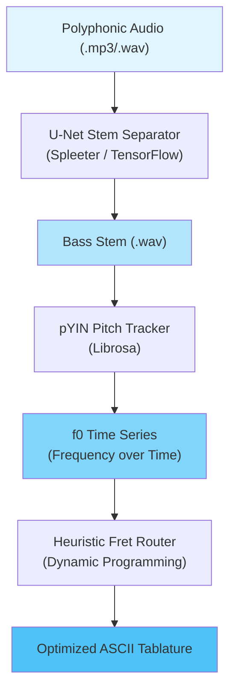

# 🎸 Punkito Tabs Oracle for Bass

**Language / Idioma:** 🇺🇸 English | [🇪🇸 Leer en Español](./README.es.md)

> **AI-powered bass isolation and tablature transcription system** — Convert any polyphonic audio into playable bass guitar tabs automatically.

⚠️ **Project Status:** Active Development (MVP Architecture Complete)

## 🎯 What This Project Does

Punkito Tabs Oracle is an intelligent audio processing pipeline that:

1. **Isolates the bass stem** from any polyphonic audio (drums, guitar, vocals, etc.) using neural source separation
2. **Detects the fundamental pitch** of the bass line with high accuracy in the low-frequency register
3. **Maps pitches to the fretboard** using ergonomic optimization for natural hand positioning
4. **Generates ASCII tablature** ready to play on a 4-string bass guitar

### Example Workflow

```
Input: song.mp3 (Full Mix)
   ↓
[U-Net Stem Separator] → Isolates bass frequencies
   ↓
[pYIN Pitch Tracker] → Detects f0 (fundamental frequency)
   ↓
[Fretboard Router] → Calculates optimal string/fret combinations
   ↓
Output: bass_tabs.txt (Playable ASCII Tablature)
```

## 🏗️ System Architecture

The engine operates as a **decoupled, multi-stage processing pipeline**:



## 📐 Mathematical Foundations

### 1. Neural Source Separation (U-Net)

Using a Deep Convolutional U-Net trained on the **MusDB18 dataset**, we isolate bass energy from the polyphonic mix.

The network computes the **Short-Time Fourier Transform (STFT)**:

$$X(t, f) = \int_{-\infty}^{\infty} x(\tau) w(\tau - t) e^{-j 2 \pi f \tau} d\tau$$

Where:
- $x(\tau)$ = input audio signal
- $w(\tau - t)$ = analysis window (Hann window)
- $X(t, f)$ = time-frequency representation

The U-Net predicts **soft masks** over magnitude spectrograms to isolate bass frequencies, then reconstructs clean bass audio via inverse STFT.

**Key Dependencies:**
- TensorFlow/Keras (neural network runtime)
- Spleeter (pre-trained 4-stem separation model)
- Librosa (audio I/O and spectral processing)

### 2. Probabilistic YIN (pYIN) Pitch Tracking

Standard autocorrelation suffers from **octave errors** in the bass register (41.2 Hz – 392.0 Hz). pYIN uses a **Hidden Markov Model (HMM)** with Viterbi decoding to resolve ambiguities.

**Cumulative Mean Normalized Difference Function:**

$$d_t(\tau) = \begin{cases} 1, & \text{if } \tau = 0 \\ \dfrac{d'_t(\tau)}{\frac{1}{\tau} \sum_{j=1}^{\tau} d'_t(j)}, & \text{otherwise} \end{cases}$$

The HMM models multiple pitch hypotheses simultaneously and selects the most probable sequence over time, dramatically improving accuracy for monophonic bass sources.

**Key Dependencies:**
- Librosa (librosa.yin or librosa.pyin)
- NumPy (signal processing)

### 3. Ergonomic Fretboard Routing

A single pitch (MIDI note) can be played at **multiple physical locations** (String, Fret) on a bass neck. Finding the **optimal sequence of hand positions** is modeled as a **shortest-path optimization**:

$$C\left((S_{i-1}, F_{i-1}), (S_i, F_i)\right) = w_1 \cdot |F_i - F_{i-1}| + w_2 \cdot P(S_i) + w_3 \cdot I(F_i = 0)$$

Where:
- $|F_i - F_{i-1}|$ = horizontal fret displacement (minimize hand movement)
- $P(S_i)$ = string preference (favor lower strings for lower pitches)
- $I(F_i = 0)$ = open string bonus (reduces hand fatigue)
- $w_1, w_2, w_3$ = dynamically tunable cost weights

## 📂 Project Structure

```
punkito-tabs-oracle/
├── config/
│   ├── locales/
│   │   ├── en.json            # English CLI translation keys
│   │   └── es.json            # Spanish CLI translation keys
│   └── settings.toml          # Physical bass parameters & cost weights
├── docs/
│   └── ARCHITECTURE.md        # Detailed technical specifications
├── src/
│   └── punkito_tabs_oracle/
│       ├── __init__.py
│       ├── cli.py             # Bilingual CLI orchestrator
│       ├── dsp/
│       │   └── pitch.py       # pYIN pitch tracking (Librosa wrapper)
│       ├── ml/
│       │   └── separator.py   # TensorFlow source separation interface
│       └── tab/
│           └── router.py      # Fretboard optimization (Dynamic Programming)
├── tests/                     # Unit & integration test suite
├── pyproject.toml             # Modern Python package config (PEP 518)
└── .gitignore
```

## 🚀 Installation & Setup

### Requirements
- **Python 3.9** or **3.10** (3.11+ not yet tested)
- Git with Bash

### Step 1: Clone the Repository

```bash
git clone https://github.com/blackmetalhans/punkito-tabs-oracle.git
cd punkito-tabs-oracle
```

### Step 2: Create & Activate Virtual Environment

```bash
# Create venv
py -3.10 -m venv env

# Activate (Windows)
env\Scripts\activate

# OR activate (macOS/Linux)
source env/bin/activate
```

### Step 3: Install Dependencies

```bash
# Upgrade pip
python -m pip install --upgrade pip

# Install package in development mode with dev extras
pip install -e .[dev]
```

This installs:
- Core dependencies: `librosa`, `numpy`, `scipy`, `tensorflowspleeter`
- Dev tools: `pytest`, `black`, `flake8`, `mypy`

## 💻 Current Functionality

### 1. Bilingual CLI Interface ✅

The package provides a fully functional **bilingual command-line interface**:

```bash
# English mode
punkito-tabs --help
punkito-tabs --language en

# Spanish mode
punkito-tabs --language es
```

The CLI successfully:
- Parses command-line arguments
- Loads configuration from `config/settings.toml`
- Routes translations from `config/locales/en.json` and `config/locales/es.json`
- Displays help text in the requested language

### 2. Configuration System ✅

The `config/settings.toml` file defines:
- Bass physical parameters (string count, fret range, tuning)
- Cost function weights for ergonomic optimization
- Audio processing settings (sample rate, hop length, threshold values)

All parameters are **dynamically loaded** and **user-tunable** without code changes.

### 3. Package Architecture ✅

Complete **modular architecture** with clean separation of concerns:
- **DSP Layer**: Audio signal processing and pitch detection
- **ML Layer**: Neural stem separation interface
- **Tab Layer**: Fretboard mapping and tablature generation
- **CLI Layer**: User-facing command orchestration

Each module defines clear **input/output contracts** ready for implementation.

## 🔄 Integration Roadmap (Planned)

- [ ] **Phase 1**: Integrate Librosa pYIN pitch tracking in `dsp/pitch.py`
- [ ] **Phase 2**: Integrate Spleeter stem separation in `ml/separator.py`
- [ ] **Phase 3**: Implement dynamic programming fretboard router in `tab/router.py`
- [ ] **Phase 4**: End-to-end pipeline integration & testing
- [ ] **Phase 5**: GUI and batch processing modes

## 📊 Testing

Run the test suite:

```bash
pytest -v
pytest --cov=src/punkito_tabs_oracle  # With coverage
```

Current test coverage includes:
- CLI argument parsing and language routing
- Configuration file loading and validation
- Module import and initialization

## 🎓 Learning Resources

- **[ARCHITECTURE.md](./docs/ARCHITECTURE.md)** — Deep technical specifications
- **Librosa Documentation**: https://librosa.org
- **Spleeter**: https://github.com/deezer/spleeter
- **pYIN Paper**: Mauch & Dixon (2014) - "Probabilistic Transcription of Sung Melody"

## 🤝 Contributing

Contributions are welcome! For major changes:

1. Fork the repository
2. Create a feature branch: `git checkout -b feature/my-feature`
3. Commit changes: `git commit -m 'Add my feature'`
4. Push to branch: `git push origin feature/my-feature`
5. Open a Pull Request

Please ensure:
- Code follows PEP 8 style guidelines
- All tests pass: `pytest`
- New features include test coverage

## 📝 License

This project is released under the MIT License. See LICENSE file for details.

## 🎵 Acknowledgments

- **Spleeter** team (Deezer) for pre-trained source separation models
- **Librosa** team for excellent audio processing tools
- **pYIN algorithm** (Mauch & Dixon) for robust pitch detection
- The open-source audio DSP community

---

**Questions?** Open an issue on GitHub or check the documentation in `/docs`.

**Last Updated:** June 2026
