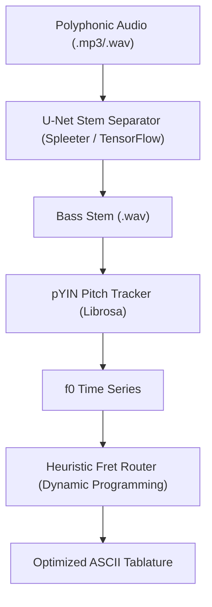

# Punkito Tabs Oracle for Bass

**Language / Idioma:** 🇺🇸 English | [🇪🇸 Leer en Español](./README.es.md)

⚠️ **Project Status:** Architectural Skeleton & API Contract (Pre-Alpha)

This repository is currently in an early architectural stage. The code establishes the complete package structure, directory layout, dependency management, bilingual CLI orchestration (config/locales/), and physical parameter configuration. All components work together as an integrated system.

The core processing modules within `src/punkito_tabs_oracle/` (dsp, ml, and tab) currently act as architectural stubs/interfaces. They define the intended input/output boundaries of our system contract.

## Technical & Algorithmic Architecture

The engine operates as a decoupled, multi-stage processing pipeline:



## Mathematical Foundations

### 1. Neural Source Separation (U-Net)

Using a Deep Convolutional U-Net model trained on the MusDB18 dataset, the engine computes the Short-Time Fourier Transform (STFT) of the polyphonic input signal:

$$X(t, f) = \int_{-\infty}^{\infty} x(\tau) w(\tau - t) e^{-j 2 \pi f \tau} d\tau$$

Where $w(\tau - t)$ is the analysis window (e.g., Hann window). The convolutional network predicts soft-masks over the magnitude spectrogram to isolate the bass spectral energy, reconstructs the time-domain waveform via inverse STFT, and saves the resulting bass stem as a `.wav` file.

**Key Dependencies:**
- TensorFlow/Keras (neural network runtime)
- Spleeter (pre-trained 4-stem separation model)
- Librosa (audio I/O and spectral processing)

### 2. Probabilistic YIN (pYIN) Pitch Tracking

Standard autocorrelation is highly susceptible to octave-doubling or octave-halving errors in the low-frequency register ($41.2 \text{ Hz}$ to $392.0 \text{ Hz}$) where the bass operates. To achieve robust, musically-coherent pitch estimates, we employ the **Probabilistic YIN (pYIN)** algorithm.

First, we compute the Cumulative Mean Normalized Difference Function:

$$d_t(\tau) = \begin{cases} 1, & \text{if } \tau = 0 \\ \frac{d'_t(\tau)}{\frac{1}{\tau} \sum_{j=1}^{\tau} d'_t(j)}, & \text{otherwise} \end{cases}$$

Where $d'_t(\tau)$ is the raw difference function. pYIN models multiple pitch candidates and utilizes a Hidden Markov Model (HMM) with Viterbi decoding to compute transition probabilities between pitch states, effectively "smoothing out" octave errors and producing a temporally coherent f0 trajectory.

**Key Dependencies:**
- Librosa (librosa.piptrack or librosa.yin)
- NumPy (signal processing)

### 3. Fretboard Mapping & Ergonomic Routing

A single pitch (MIDI note) can be played at multiple physical coordinates (String, Fret) on a 4-string bass neck. Finding the optimal sequence of hand movements is modeled as a shortest-path optimization problem using **Dynamic Programming**.

Let $S_i$ be the target string and $F_i$ be the target fret at quantized frame $i$. The transition cost $C$ from state $i-1$ to state $i$ is calculated as:

$$C\left((S_{i-1}, F_{i-1}), (S_i, F_i)\right) = w_1 \cdot |F_i - F_{i-1}| + w_2 \cdot P(S_i) + w_3 \cdot I(F_i = 0)$$

Where:

- $|F_i - F_{i-1}|$ represents the physical horizontal displacement of the fretting hand along the neck.
- $P(S_i)$ is a string-specific penalty favoring lower strings for lower registers to maintain consistent timbral weight.
- $I(F_i = 0)$ is an indicator function that yields a negative cost (reward) for open strings, reducing physical hand fatigue.
- $w_1, w_2, w_3$ are weights calibrated dynamically via configuration files.

## Directory Layout

```
punkito-tabs-oracle/
├── config/
│   ├── locales/
│   │   ├── en.json            # English CLI translation keys
│   │   └── es.json            # Spanish CLI translation keys
│   └── settings.toml          # Dynamic physical parameters & cost weights
├── docs/
│   └── ARCHITECTURE.md        # Technical architecture details
├── src/
│   └── punkito_tabs_oracle/
│       ├── __init__.py
│       ├── cli.py             # System orchestrator and argument parser
│       ├── dsp/
│       │   └── pitch.py       # pYIN calculations using Librosa (Stub)
│       ├── ml/
│       │   └── separator.py   # TensorFlow source separation (Stub)
│       └── tab/
│           └── router.py      # Fretboard routing cost optimizer (Stub)
├── tests/                     # Automated testing suite
├── pyproject.toml             # Modern package build definition (PEP 518)
└── .gitignore
```

## Installation & Setup

Ensure you have **Python 3.9 or 3.10** installed. In your Git Bash, run:

### Clone the repository:

```bash
git clone https://github.com/blackmetalhans/punkito-tabs-oracle.git
cd punkito-tabs-oracle
```

### Initialize and activate your environment:

```bash
py -3.10 -m venv env
source env/Scripts/activate
```

### Install the package in development mode:

```bash
python -m pip install --upgrade pip
pip install -e .[dev]
```

## Current Execution Sandbox

While the core DSP models are being integrated, you can run the CLI entry point to verify the configuration parsing and bilingual routing:

```bash
punkito-tabs --help
```
